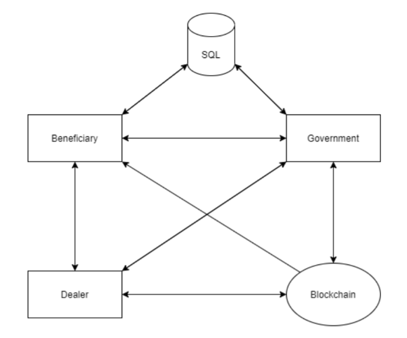

# E-Voucher Blockchain Solution
Issuing vouchers is an alternative means to implement social welfare. While
paper-based voucher is a working method, it is susceptible to some security issues such as
counterfeiting, reproducing, and their relatively low effectiveness. This project explores how
to implement necessary security methods with encryption and cryptography in form of a
consortium blockchain to build a secure e-voucher system as an alternative for its traditional
paper-based voucher.
 

## System Design

  

The system is based on blockchain, a system in which a record or a ledger of a transaction
made in cryptocurrency are maintained across several computers that are linked in a
peer-to-peer network.  
A blockchain has these following characteristics that covers the security requirements:
- Immutable: The blockchain only supports add operation, transaction cannot be
deleted or modified in any way, making all transaction immutable
- Distributed: The ledger or the record of the transactions are replicated across
computers rather than being stored in a centralized servers, any computer with
internet access can download the blockchains
- Uses Proof of Work (PoW): Some special users, also known as miners will compete
with each other in order to solve a cryptographic puzzle that will give them the rights
to add themselves in the blockchain ledger. This PoW helps to make the system more
secure with the non-repudiation properties.
- Cryptographic: Cryptography is used to verify whether or not the user has the bitcoin
that they are trying to send, and to manage how the transactions are added to the
bitcoin ledgers.

## Research
The architecture of the solution comes from the following paper:  
C. Hsu, S. Tu and Z. Huang, "Design of an E-Voucher System for Supporting Social
Welfare Using Blockchain Technology", Sustainability, vol. 12, no. 8, p. 3362, 2020. Available:
10.3390/su12083362
  
Implementation is based on:  
"A Practical Introduction to Blockchain with Python // Adil Moujahid // Data
Analytics and more", Adilmoujahid.com, 2021. [Online]. Available:
http://adilmoujahid.com/posts/2018/03/intro-blockchain-bitcoin-python. [Accessed: 26-
Apr- 2021].
